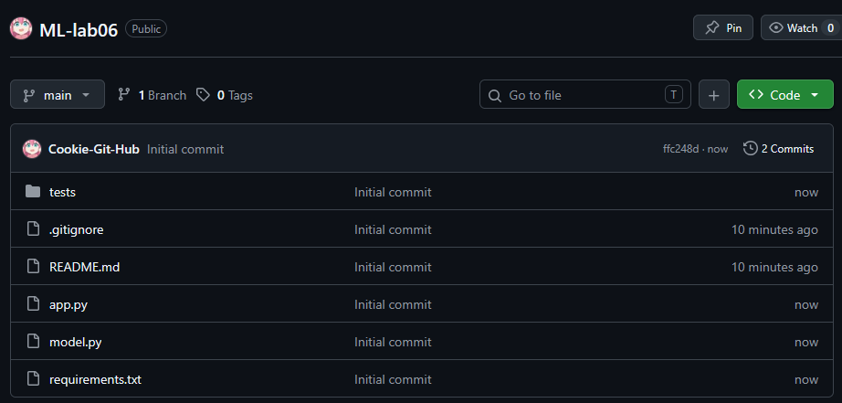
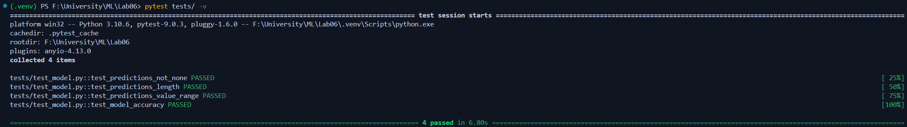
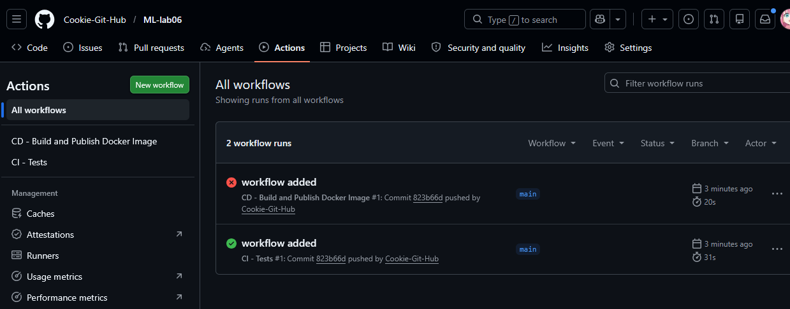
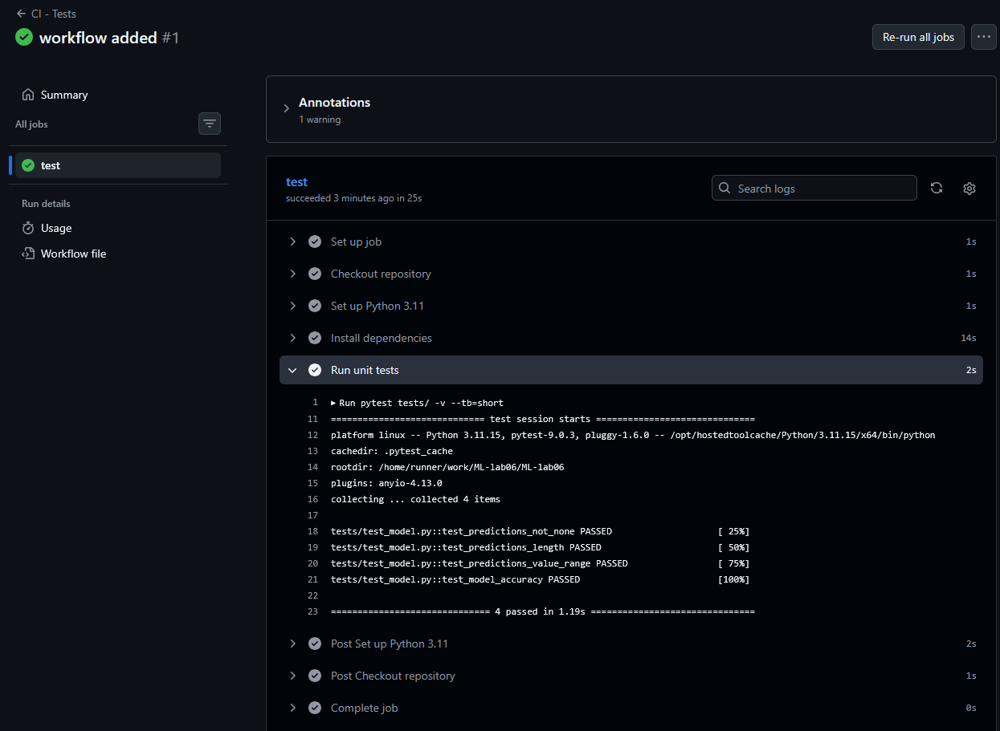
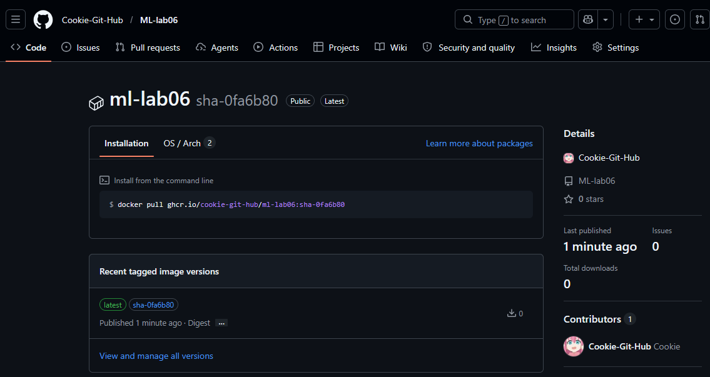
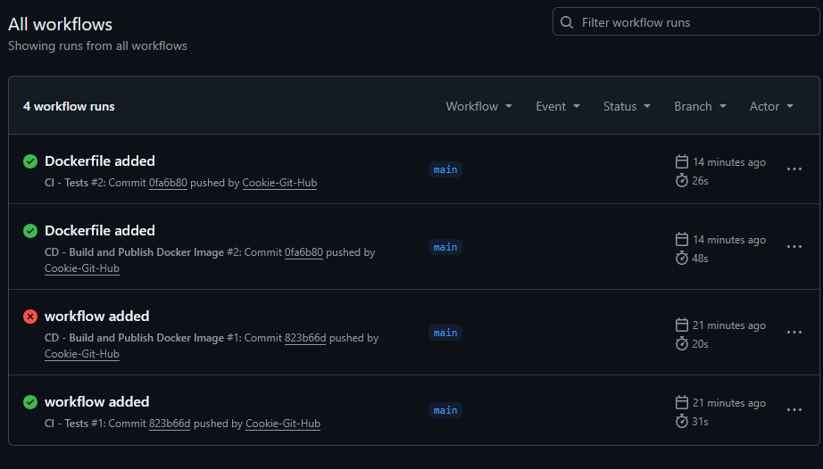

# ML-lab06

Utworzone repozytorium na GitHubie

Lokalne uruchomienie testów - wszystkie 4 zakończone statusem PASSED

Zakładka Actions z uruchomionymi automatycznie workflow

Szczegóły joba CI - Tests z przebiegiem testów jednostkowych

Opublikowany obraz w GitHub Container Registry

